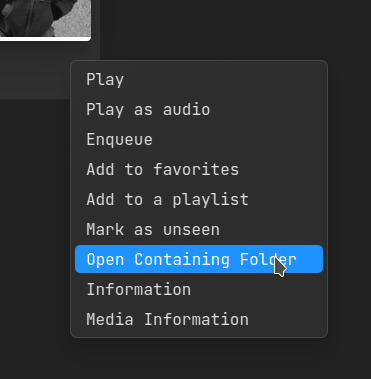
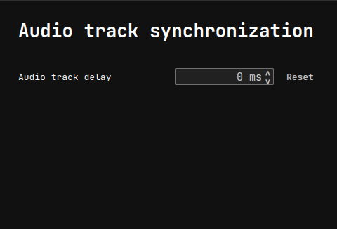
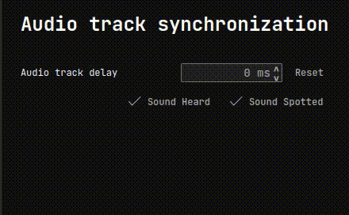
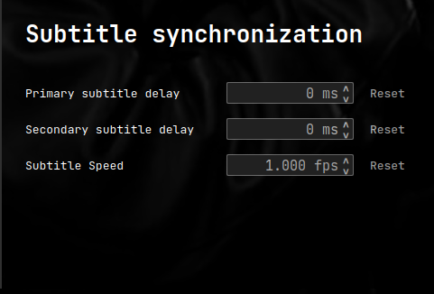
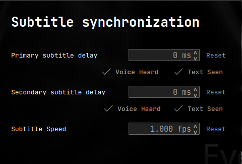
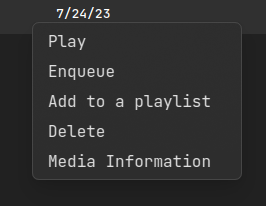

# My GSoC 2023 Report

**Student:** Mohit Marathe([@mohit-marathe](https://code.videolan.org/mohit-marathe))

**Organization:** [VideoLAN](https://www.videolan.org/)

**Project:** [VLC Qt Interface Redesign](https://summerofcode.withgoogle.com/programs/2023/projects/z26bcE5j)

**Mentor:** Pierre Lamot

---

## Overview

VLC is a free and open-source cross-platform multimedia player and framework that plays most multimedia files as well as DVDs, Audio CDs, VCDs, and various streaming protocols. Check out the [official site](https://www.videolan.org/vlc/) for more information. 

## Project 

The goal of this project is to contribute to the development of VLC 4.0.0, an upcoming version that showcases a redesigned interface. The project focuses on enhancing user experience and introducing a more 
intuitive "media center" feel. 

Within this context, the project entails integrating the new interface with the existing media library and current interface. By incorporating various features, the aim is to enhance usability and enrich the
software with additional functionalities. These improvements will empower users with a more intuitive and feature-rich media playback experience. 

VLC uses QML(Qt Modeling Language) as the front end and C++ as the back end.

## Work

### Community Bonding Period

In this period, I mostly focused on gaining a solid grasp of QML and Qt framework in general. For this, I followed [Qt/QML Tutorial Playlist](https://www.youtube.com/playlist?list=PL6CJYn40gN6hdNC1IGQZfVI707dh9DPRc) by KDAB. I also read some of the chapters of the book [Qt5 Cadaques](http://qmlbook.github.io/).

Apart from these, I tried to work on some issues as it is the best way to learn about the codebase.

### Some Merge Requests before the official coding period

### [MR!3446: Fix alignment issues when qt-safe-area is enabled](https://code.videolan.org/videolan/vlc/-/merge_requests/3446)

VLC 4 provide the ability to run on TV (on a set-top box, or a raspberry pi for example), TV has constraints regarding where you're allowed to put graphical elements, see https://en.wikipedia.org/wiki/Safe_area_(television). There were some alignment issues in this setup. 
I didn't even know QML when I started working on this issue 😅. But with the help of my mentor, I got my first patch merged to VLC.

### [MR!3437: Add option for opening parent folder in MLContextMenu](https://code.videolan.org/videolan/vlc/-/merge_requests/3437)

This was supposed to be a _good first issue_ but it turned out to be a bit challenging (at least for beginners). I learned a lot about VLC's codebase while working on this issue as I had to understand how 
each component connects with each other. Working on this MR gave me good insights about model-view-delegate architecture in Qt.
Initially, I wrote the function to open parent directory 2 times (for video and audio), and then my mentor suggested I refactor it (to avoid code duplication). Then I learned about a really powerful thing 
called [template](https://en.m.wikipedia.org/wiki/Template_(C%2B%2B)) in C++, with the help the which I was able to refactor the function.

### Coding Period

### [MR!3796: Redesign Synchronization Page](https://code.videolan.org/videolan/vlc/-/merge_requests/3796)

| Before      | After |
| ----------- | ----------- |  
 | 
 | 

This was my first task in the coding period. The idea was to make synchronizing audio and subtitles easier for the users. Now you don't have to calculate the delay in the track manually. I learned about a
lot of things includings things specific to Qt framework and also a lesson on good code design vs bad code design. It was while working on this feature that I realized the power of **Signals** and **Slots** 
in Qt. I also learned about how to create custom components in C++ that can be used in QML. 
Initially I connected the delay buttons with the spinbox to change the value of subtitle or audio delay in the spinbox, which will then change the delay. This was an easier and intuitive way to implement 
this feature but its a bad code design because this is how it works: **Calculate Delay with the help of buttons --> Change the value of SpinBox --> Change the actual delay to the value of SpinBox**__. This 
is also known as [spaghetti code](https://en.wikipedia.org/wiki/Spaghetti_code). My mentor suggested this instead: _**Calculate Delay with the buttons --> Change the delay to the calculated delay**_. The 
reason why the latter structure is better is because its less complicated and hence easier to maintain.

Commits

- [qt: create DelayEstimator class](https://code.videolan.org/videolan/vlc/-/merge_requests/3796/diffs?commit_id=738291698014daccb798b1058ade78f832690c5b)

- [qt: create functions to add delay](https://code.videolan.org/videolan/vlc/-/merge_requests/3796/diffs?commit_id=e2497b63b004b3403ea1f5f117d90d3c4a2d0036)

- [qt: create TrackDelayButton from ButtonExt](https://code.videolan.org/videolan/vlc/-/merge_requests/3796/diffs?commit_id=40d39356ef8c6d149b8e665e14983de4be91faf7)

- [qt: Redesign TracksPageAudio and TracksPageSubtitle](https://code.videolan.org/videolan/vlc/-/merge_requests/3796/diffs?commit_id=4982441ff0b09b6aae372f3dc0a700995948f019)

### [MR!3819: Add option to delete Discover/URL items in MLContextMenu](https://code.videolan.org/videolan/vlc/-/merge_requests/3819)

With VLC, you can stream videos or radio from the internet by using URL. After you stream any media, it gets added to the history. The task was to add an option to delete any media item from the history. 
While working on this task, I learned how to use [glue code](https://www.google.com/url?sa=t&rct=j&q=&esrc=s&source=web&cd=&cad=rja&uact=8&ved=2ahUKEwj1xKDNjaaAAxUgSWwGHaaGC5YQFnoECBgQAw&url=https%3A%2F%2Fen.wikipedia.org%2Fwiki%2FGlue_code&usg=AOvVaw2B0EirDGNdV-8WF5TVlMjF&opi=89978449) to access code from different modules that would otherwise be incompatible. I also learned to use [Lambda expressions](https://en.cppreference.com/w/cpp/language/lambda) in C++.

Commits:

- [medialibrary: add VLC_ML_REMOVE_STREAM](https://code.videolan.org/videolan/vlc/-/merge_requests/3819/diffs?commit_id=8ba9acdc863a8a300d2f44bb113997b2f01b9130)
- [qt: create function to delete item](https://code.videolan.org/videolan/vlc/-/merge_requests/3819/diffs?commit_id=007153c38de80170ffdef3ce1e07934173c85af8)
- [qt: add isDeletable as role of the mlurlmodel](https://code.videolan.org/videolan/vlc/-/merge_requests/3819/diffs?commit_id=2f4f7bf7f87d1206355b0679db7c491db90f0f4b)
- [qt: add option to delete Stream/URL item in the MLContextMenu](https://code.videolan.org/videolan/vlc/-/merge_requests/3819/diffs?commit_id=2f4f7bf7f87d1206355b0679db7c491db90f0f4b)

### [MR!3924: Add preset layouts in Preferences](https://code.videolan.org/videolan/vlc/-/merge_requests/3924)

VLC allows a lot of customization options. The task was to add some preset layouts for the user to choose from. For this, I had to get familiar with Qt Widgets. I also had to learn how to use Qt Designer
application to work with _.ui_ files.

Commits: 
- [qt: add presets for selecting layout](https://code.videolan.org/videolan/vlc/-/merge_requests/3924/diffs?commit_id=aa9bb39ba14b3ac5ed0519b3a4cad13311c6a25e)
- [qt: add Customize Interface button](https://code.videolan.org/videolan/vlc/-/merge_requests/3924/diffs?commit_id=11164f30591b41701f6ae7d3e8e3a22a6c534e9a)
- [qt: add tooltip for layout buttons](https://code.videolan.org/videolan/vlc/-/merge_requests/3924/diffs?commit_id=11164f30591b41701f6ae7d3e8e3a22a6c534e9a)

### [MR!3912: Toggle Play/Pause on mouse click](https://code.videolan.org/videolan/vlc/-/merge_requests/3912)

This feature allows user to toggle play/pause  when clicked anywhere on the video screen. I also added a config option to disable this feature. A discussion is going on whether this option should be added
to "Simple Preferences" or not. This will be merged after some other related patch will be merged.

Commits:
- [qt: toggle play/pause by mouse click](https://code.videolan.org/videolan/vlc/-/merge_requests/3912/diffs?commit_id=8a184b3830a6a2749bc2f812cd47fb91915e686c)
- [qt: add config option for toggle pause on click](https://code.videolan.org/videolan/vlc/-/merge_requests/3912/diffs?commit_id=f1404b2f55753a38ffc94aa3a54b8c8b912bbf53)

### [MR!4000: Add button to toggle Control Bar visibility for interactive videos](https://code.videolan.org/videolan/vlc/-/merge_requests/4000)

Whenever you move the mouse, the controlbar at the top and the bottom of the player becomes visible. In case of [interactive videos](https://en.wikipedia.org/wiki/Interactive_video), the controlbar may
overlap with the interactive element of the video and can be quite annoying. This merge request adds a button to toggle control bar visibility in case of interactive videos.

Commits:
- [qt: add expand_inverted.svg](https://code.videolan.org/videolan/vlc/-/merge_requests/4000/diffs?commit_id=9656ddc336900ed76fb41a8439e7a5e782c785a0)
- [qt: add button to toggle controlbar visibility for interactive videos](https://code.videolan.org/videolan/vlc/-/commit/bf671c32057144286d3357df7aaab379120209fa?merge_request_iid=4000)

